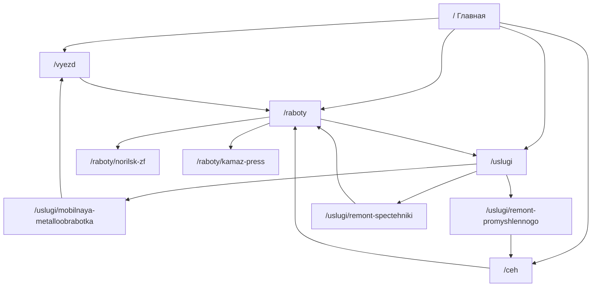

# GRC RUS — концепт-демо

> [!summary] Одной строкой
> Русскоязычная витрина **дизайна + UX + кода** для [[README|GRC (ДжиЭрСи)]]. Не официальный 1grc.ru. Показываем заказчику: «мы понимаем промышленный B2B и умеем сделать сайт, который продаёт яснее».

**Связанные файлы в репозитории:** [[README]], `Критика сайта.txt`

---

## Навигация по заметке

- [[#Контекст и границы|Контекст]]
- [[#Карта сайта|Карта сайта]]
- [[#Ветки Git и темы|Ветки и темы]]
- [[#Дизайн и UX|Дизайн]]
- [[#Контент|Контент]]
- [[#Код и структура|Код]]
- [[#Деплой|Деплой]]
- [[#Показ клиенту|Показ клиенту]]
- [[#История решений|История]]
- [[#Бэклог|Бэклог]]

---

## Контекст и границы

### Зачем существует демо

| Вопрос | Ответ |
|--------|--------|
| Это новый 1grc.ru? | **Нет** — концепт для презентации возможностей |
| Заменяет US-сайт? | **Нет** — у GRC параллельно идёт американский сайт |
| Язык | Только **RU** |
| Аудитория показа | Заказчик GRC / ЛПР по маркетингу и сайту |
| Сообщение | Разобрали текущий сайт → вот как может выглядеть «GRC 2.0» |

### Исходные материалы

- Живой сайт: [www.1grc.ru](https://www.1grc.ru)
- Отчёт **Site Doctor** (~48/100) — слабая ясность на первом экране
- `Критика сайта.txt` — жёсткий разбор позиционирования (корпоративный туман vs «мужики в цехе»)

> [!warning] Дисклеймер на демо
> В футере и баннере (на preview-ветке): «концепт-демо, не официальный сайт заказчика».

### Бренд в демо

| Поле | Значение |
|------|----------|
| Название | GRC |
| Юр. | ДжиЭрСи |
| Слоган | Ваше ремонтное подразделение |
| Телефон | 8 800 500-63-74 |
| Email | zapros@1grc.ru |

---

## Карта сайта



### Главная `/` — порядок блоков

1. `Header` — навигация, CTA
2. `Hero` — позиционирование, фото, 2 CTA
3. `TrustBar` — 5 цифр доверия
4. `Directions` — выезд / цех
5. `Services` — 4 направления + 8 компетенций
6. `Process` — 6 шагов
7. `Cases` — 6 featured-кейсов
8. `Reviews` — отзывы + логотипы
9. `Urgency` — простой / срочность
10. `Contact` — форма (демо)
11. `Footer`

### Все URL (13 в build)

| URL | Тип | Кейс / примечание |
|-----|-----|-------------------|
| `/` | Лендинг | — |
| `/vyezd` | Производство | `#kejs-uaz` — пресс UAZ |
| `/ceh` | Производство | `#kejs-mondelis` — Mondelēz FRISSE |
| `/raboty` | Каталог | 18 проектов, 5 фильтров |
| `/raboty/norilsk-zf` | Разбор | Канавки ZF, Норникель |
| `/raboty/kamaz-press` | Разбор | Станина LZK-6300, KAMAZ |
| `/uslugi` | Хаб | 4 направления, отрасли |
| `/uslugi/mobilnaya-metalloobrabotka` | Услуга | → выезд |
| `/uslugi/remont-promyshlennogo` | Услуга | → цех |
| `/uslugi/remont-spectehniki` | Услуга | → каталог |

---

## Ветки Git и темы

| Ветка | Тема | Деплой | Когда смотреть |
|-------|------|--------|----------------|
| `main` | **Тёмная** промышленная | Production на Vercel | Основной показ «смелый ребренд» |
| `preview/hybrid-theme` | **Гибрид** | Preview URL Vercel | Тёмный hero + срочность + подвал; светлое тело; баннер «Превью» |

### Тёмная (`main`)

- Фон: `grc-graphite` / `grc-steel`
- Ощущение: цех, контраст, «другой продукт» vs текущий светлый 1grc
- Глубина слоёв: наслоение graphite → steel → border

### Гибрид (`preview/hybrid-theme`)

- Светлое тело: `grc-paper`, белые карточки, `grc-line`
- Тёмные полосы: `.grc-band` на hero, внутренних шапках, срочности, футере
- Шапка: белая
- **Минус:** на светлых блоках визуальная глубина почти плоская (осознанный компромисс, пока оставляем)

> [!tip] Выбор темы для встречи
> - «Мы не похожи на ваш сайт, но сильнее» → `main`
> - «Эволюция GRC, ближе к B2B-документу» → hybrid (после доработки глубины на светлом — идеально)

---

## Дизайн и UX

### Типографика

- Заголовки: **Oswald** (uppercase, промышленный ритм)
- Текст: **Source Sans 3**
- Акцент: **#e85a1f** (оранжевый GRC)

### Токены (Tailwind `@theme`)

| Токен | Назначение |
|-------|------------|
| `grc-orange` | CTA, метки |
| `grc-graphite` / `grc-steel` | Тёмные поверхности |
| `grc-paper` / `grc-card` | Светлые (hybrid) |
| `grc-ink` / `grc-ink-muted` | Текст на светлом |
| `grc-line` | Рамки на светлом |
| `grc-highlight` | Блок «Результат» в кейсах |
| `.grc-band` | Тёмная полоса секции |

### Принципы копирайта

- Конкретные узлы: валы, посадки, редукторы, прессы
- Сценарий боли: простой, окно ремонта, без замены агрегата
- Без «адаптивного производства по ремонту…» (корпоративный туман)
- CTA: «Отправить фото поломки», «Связаться с инженером» → `#contact` (не `tel:` в hero — на Windows открывался «Телефон»)

### Перекрёстная навигация

- `/vyezd`, `/ceh`, `/raboty` ↔ `/uslugi`
- Главная: «Все проекты (18)», «Все услуги»
- Header: «Наши работы» → `/raboty`, «Услуги» → `/uslugi`

---

## Контент

### Источник данных

Всё в `src/data/*.ts` — без CMS, правки через PR/коммит.

| Файл | Содержимое |
|------|------------|
| `site.ts` | brand, images, trustStats, directions, services, processSteps, reviews, clientLogos |
| `raboty.ts` | 18 проектов, фильтры, `featuredOnHome` |
| `vyezd.ts` | страница выезда + кейс UAZ |
| `ceh.ts` | страница цеха + кейс Mondelēz |
| `uslugi.ts` | 4 направления, отрасли, 3 страницы услуг |
| `case-details.ts` | norilsk-zf, kamaz-press |

### Каталог `/raboty` — фильтры

- Все
- Выезд
- Цех
- Металлургия
- ТПА
- Прессы

### Featured на главной (6)

Берутся из `raboty.ts` → `featuredOnHome: true`. Среди них 2 со ссылкой на полный разбор (`detail: true`).

### Изображения

- Домен: `www.1grc.ru/wp-content/**`
- Конфиг: `next.config.ts` → `remotePatterns`
- Hero / направления: `video-poster.jpg`, `home_1.jpg`, `home_2.jpg`

> [!note] Добавить проект
> 1. Запись в `workProjects` в `raboty.ts`
> 2. При необходимости — `case-details.ts` + slug в `generateStaticParams`

---

## Код и структура

### Стек

- Next.js **15** App Router
- React **19**
- TypeScript
- Tailwind **4**
- SSG (статика), 13 страниц

### Дерево (сокращённо)

```
ArtemSiteRus/
├── README.md
├── Критика сайта.txt
├── obsidian/
│   └── GRC-RUS-Demo.md          ← эта заметка
├── src/
│   ├── app/                     # маршруты
│   ├── components/              # UI
│   └── data/                    # контент
├── next.config.ts
└── package.json
```

### Ключевые компоненты

| Компонент | Роль |
|-----------|------|
| `Header` / `SubHeader` | Шапка главной / внутренних |
| `Hero` | Первый экран |
| `TrustBar` | Цифры |
| `Directions` | Выезд + цех |
| `Services` | Компетенции |
| `Process` | 6 шагов |
| `Cases` | 6 кейсов |
| `Reviews` | Отзывы |
| `Urgency` | Срочность |
| `Contact` | Форма (client) |
| `Footer` | Подвал |
| `RabotyCatalog` | Фильтры + сетка (client) |
| `CaseDetailView` | Шаблон разбора |
| `ServiceDirectionPage` | Шаблон услуги |
| `PreviewBanner` | Только hybrid-ветка |

### Локальный запуск

```powershell
cd D:\ArtemSiteRus
$env:NODE_OPTIONS='--use-system-ca'   # если SSL при npm install
npm install
npm run dev
```

→ http://localhost:3000

```bash
npm run build && npm run start
```

---

## Деплой

| Среда | Источник | Примечание |
|-------|----------|------------|
| Vercel Production | `main` | Автодеплой с GitHub |
| Vercel Preview | `preview/hybrid-theme` | Preview URL на push |

Env vars **не нужны**.

---

## Показ клиенту

### Сценарий 5 минут

1. **Hero** — что ремонтируем, выезд + цех, CTA
2. **Цифры** — доверие без простыни
3. **Выезд / цех** — два формата, ссылка вглубь
4. **Кейс** — Norilsk или KAMAZ (разбор)
5. **Каталог** — масштаб (18), не всё на главную
6. **Форма** — «так может выглядеть путь заявки»

### Что подчеркнуть

- Поняли специфику: простой дороже простоя
- Реальные заказчики и фото с их домена
- Не «перекрасили Tilda», а **структура под путь клиента**
- RU-демо **не мешает** US-проекту

### Чего не обещать

- Миграцию всего 1grc.ru
- CRM, личный кабинет, блог, SEO-аудит в этом репо
- Рабочую отправку формы

---

## История решений

| Дата / этап | Решение |
|-------------|---------|
| Старт | Демо только RU, бренд GRC, фото с 1grc |
| UX | `tel:` → `#contact` для «Связаться с инженером» |
| Навигация | Header «Наши работы» → `/raboty` |
| Слой 2 | `/vyezd`, `/raboty` (18), 2 разбора |
| Слой 3 | `/ceh`, `/uslugi` + 3 подстраницы |
| Тема | `main` — тёмная; обсуждали светлую и гибрид |
| Hybrid | Ветка `preview/hybrid-theme`, баннер превью |
| Глубина hybrid | На светлом плоско — **пока оставляем** |
| Документация | README + эта заметка Obsidian |

---

## Бэклог

### Идеи (не в scope, пока)

- [ ] Вернуть глубину слоёв на светлых секциях hybrid
- [ ] Светлая тема целиком (ветка или toggle)
- [ ] Ещё 2–3 полных разбора кейсов
- [ ] Блок «парк станков» на `/ceh`
- [ ] Метрики в кейсах («2 дня», «люфт 4 мм»)
- [ ] Реальная отправка формы (email / webhook)
- [ ] Сравнение «было / стало» — только если заказчик попросит приватно

### Техдолг

- [ ] Единый компонент `PageHeroBand` вместо копипасты hero на подстраницах
- [ ] Вынести цветовую схему в `data-theme` / переключатель для презентации двух тем

---

## Быстрые ссылки

| Ресурс | URL |
|--------|-----|
| GitHub | https://github.com/zobnin8-ux/grc_rus |
| Официальный сайт | https://www.1grc.ru |
| README репо | [[README]] |

---

## Теги для графа Obsidian

`#project/grc` `#demo` `#b2b` `#nextjs` `#верстка` `#1grc` `#промышленность`
